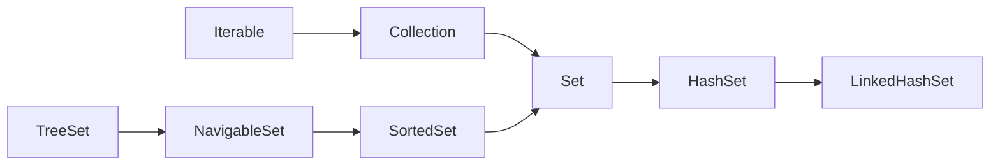

# THEME : SET, HASH_SET, LINKED_HASH_SET, SORTED_SET, NAVIGABLE_SET, TREE_SET 

## Set irarxiyasi

| Interfaces | Classes |
|------------|---------|
|  Set       |   HashSet      |
|  SortedSet  |  LinkedHashSet     |
|  NavigableSet |   TreeSet      |

## SET

* Dublikat elementlar kiritish mumkin emas
* Elementlarni qo'shish tartibi saqlanib qolmaydi
* Set interface ni o'zi yangi method tagdim etmaydi undagi barcha methodlar Collection interface dan kelgan
-----
## HASH_SET
Hashset classida Set interface dagi barcha methodlarni realizatsiyasi amalga oshirilgan.
HashSet classining o'zi qo'shimcha methodlarni taqdim etmagan

* Elementlarni saqlash uchun HashMap dan foydalanadi
* Dublikatlar (o'xshash) elementlar qo'shish mumkin emas
* Ro'yxatga qo'shish tartibi saqlanib qolmaydi va obyektlar hashing asosida saqlanadi
* Ro'yxatga null qiymat qo'shish mumkin
* HashSet da boshlang'ich hajm 16 ga teng va load factor 0.75
* HashSet synchronized emas

## Constructors in the HashSet
* HashSet() - Default constructor. Bo'sh bo'lgan HashSet ob'ekti yaratadi yaratadi
* HashSet(Collection c) - Collection ob'ektini qabul qiladi va shu collection da bor bo'lgan elementlar dan tashkil topgan HashSet obyektini yaratadi
* HashSet(int initialCapacity) - Boshlang'ich hajmi initialCapacity teng bo'lgan HashSet obyektini yaratadi
* HashSet(float loadFactor) - To'lish koeffitsienti loadFactor ga teng bo'lgan HashSet obyektini yaratadi
* HashSet(int initialCapacity, float loadFactor) - Boshlang'ich hajmi initialCapacity ga va to'lish koeffitsienti loadFactor ga teng bo'lgan HashSet obyektini yaratadi.

## HashSet muhim qoidalari

* HashSet classi obyektlarni solishtirish uchun hashCode() va equals() metodlarni ishlatadi
* Obyektning hashcode i uning xotirada turgan joyiga qarab hisoblanadi
* equals() metodi default holatda hashcode larni solishtiradi
* Biz equals metodini override qilib unda class field larini tekshiradigan qilib yozsak, ob'ektlarni HashSet ga joylashtirayotganda ularni field lari bo'yicha ham solishtiradi
* HashSet classi uchun obyektlar birxil bo'ladi agar ularning hashcode teng bo'lsa va equals() metodi true return qilsa

-----
## LINKED_HASH_SET

LinkedHashSet - hashSet larning ro'yxati deb olsak bo'ladi.
LinkedHashSet bu class bo'lib u HashSet classidan extends qilgan.
Biz bilamizki HashSet classi Set interface dan implementatsiya olgan va Set dagi barcha metodlarini realizatsiya qilgan.
Demak LinkedHashSet classiga barcha methodlar HashSet classidan kelgan.

* HashSet classining sub classi hisoblanadi
* Elementlarni saqlash uchun LinkedHashMap dan foydalanadi
* Dublikat elementlar qo'shish mumkin emas
* Ro'yxatga qo'shish tartibi saqlanib qoladi
* Ro'yxatga null qiymat qo'shish mumkin
* Keshga (xotirada/RAM da ma'lumotni ushlab turishga) asoslangan dasturlar da ishlatish tavsiya etiladi. Bunda dublikatlarga ruxsat berilmaydi va o'qish tartibi saqlanib qoladi
* HashSet da boshlang'ich hajm 16 ga teng va load factor 0.75
* LinkedHashSet synchronized emas
* LinkedHashSet deyarli HashSet bilan bir xil. Shu asosiy 2 ta farqi bor xolos. Deyarli barcha metodlari bir xil ishlaydi

## Constructor HashSet da qanday bo'lsa LinkedHashSet da ham xuddi shunday

------
## SORTED_SET
SortedSet - sort qilingan (tartiblangan) ro'yxat.
SortedSet interface da Collection interface dan kelgan metodlar va o'zi taqdim qilgan metodlar bor. SortedSet ni o'ylab topishdan maqsad Set dagi elementlarni qandaydir tartib asosida joylashtirish. 
Ya'ni HashSet da elementlar ularning hashCode asosida joylashtirilar edi. Endi SortedSet da esa elementlar qandaydir tartib asosida joylashadi. Shu tartibni biz berishimiz mumkin yoki oldindan bor bo'lsa default tartib asosida joylashishi mumkin.
Default holatda Number lar o'sish tartibda joylashadi, String lar esa alifbo tartibida joylashadi.
Agar biz o'zimiz qandaydir sort qilish (tartiblash) tartibini bersak o'sha tartib asosida ro'xhat tartiblanadi.

* Ro'yxatga dublikat elementlar kiritish mumkin emas. Yani Set ga bir xil elementlarni qayta qo'shish mumkin emas.
* Ro'yxatga elementlar qandaydir sort qilish (tartiblash) tartibiga ko'ra qo'shiladi. Ya'ni elementlar ro'yxatga qo'shilayotganda ular ro'yxatga biz bergan tartib asosida qo'shiladi. Shu order (tartiblash) logikasi orqali elementlarni joylashtir deb aytamiz va elementlar biz bergan tartib asosida ro'yxatga joylashtiriladi.

----------

## NAVIGABLE_SET
NavigableSet - Navigatsiya to'plami. Yoki navigatsiya qilish mumkin bo'lan to'plam.
NavigableSet interface da Set va SortedSet interface dan kelgan metodlar va o'zi taqdim qilgan metodlar bor.
NavigableSet ni o'ylab topishdan maqsad Set dagi elementlar bo'yicha navigatsiya (harakatlanish) uchun ishlatiladi. 

* Ro'yxatga dublikat elementlar kiritish mumkin emas. Ya'ni Set ga bir xil elementlarni qayta qo'shish mumkin emas
* Ro'yxatga elementlar qandaydir sort qilish (tartiblash) tartibiga ko'ra qo'shiladi. Ya'ni elementlar ro'yxatga qo'shilayotganda ular ro'yxatga biz bergan tartib asosida qo'shiladi. Shu order (tartiblash) logikasi orqali elementlarni joylashtir deb aytamiz va elementlar biz bergan tartib asosida ro'yxatga joylashtiriladi

----------

## TREE_SET
TreeSet - Set lar daraxti.
TreeSet bu class bo'lib u NavigableSet interface dan implementatsiya olgan va NavigableSet dagi barcha metodlarini realizatsiya qilgan.
Biz bilamizki NavigableSet interface si SortedSet interface dan extends (nasil) olgan. Bu degani NavigableSet interface da SortedSet interface da bor bo'lgan metodlar ham bor degani.
TreeSet classi o'zi qo'shimcha methodlarni taqdim etmagan.
Default holatda Number lar o'sish tartibda joylashadi, String lar esa alifbo tartibida joylashadi.
Agar biz o'zimiz qandaydir sort qilish (tartiblash) tartibini bersak o'sha tartib asosida ro'xhat tartiblanadi.
Agar TreeSet ni Custom Class (o'zimiz yozgan qandaydir class) uchun ishlatmoqchi bo'lsak, TreeSet uni qanday qilib tartiblashini bilishi kerak.
Buning uchun ishlatmoqchi bo'lgan Custom Classimiz Comparable dan implements olib compareTo metodini realizatsiya qilishi kerak. Yoki TreeSet obyektiga Comparator obyektini berib yuborishimiz kerak. Shunda biz bergan tartib bo'yicha ro'xhat sort bo'ladi.
Agar Custom Class (o'zimiz yaratgan) class uchun sort qilish (tartiblash) tartibini bermasak xatolik sodir bo'ladi.

* Elementlarni saqlash uchun Balanced Tree dan foydalanadi
* Dublikatlar elementlar qo'shish mumkin emas
* Ro'yxatga qo'shish tartibi saqlanib qolmaydi va tartib qandaydir sorting/tartiblash tartibida bo'ladi.
* Ro'yxatga null qo'shish mumkin emas

